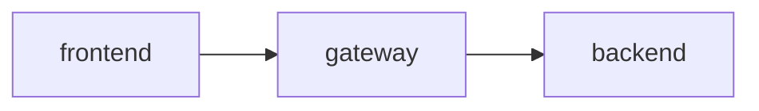

# Librarian

An application that will help manage libraries.

## Running

The entire project can be easily run using `docker compose up --build` (production setup).
If you want to run the project in the development mode (contains features like frontend auto reload) you have to run `docker compose -f compose.dev.yaml up --build --watch`.

### Environmental properties

Before running the project you have to create a `.env` file in the project root (where `compose.yaml` is located).
You can copy and rename the `.env.example` file that contains all the required properties.
The `JWT_SECRET` must be a base64-encoded string with 256 bits (32 bytes), you can generate it using this command: `openssl rand -base64 32`.

## Project structure

## License

This work is licensed under the MIT license. See the [LICENSE.md](LICENSE.md) file for more information.
