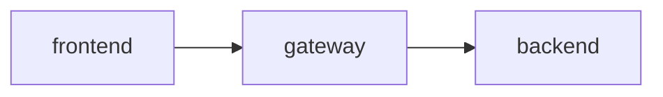

# Librarian

An application that will help manage libraries.


## Running

There are a couple of steps you need to take before running the project, see sections below to learn more.
The entire project can be easily run using `docker compose up --build` (production setup).
If you want to run the project in the development mode (contains features like frontend auto reload) you have to run `docker compose -f compose.dev.yaml up --build --watch`.

### Environmental properties

Before running the project you have to create a `.env` file in the project root (where `compose.yaml` is located).
You can copy and rename the `.env.example` file that contains all the required properties.

### TLS certificates

The gateway requires a TLS certificate to work properly. You can generate it using the command below (keep in mind that the password must much the password specified in the `.env` file).

```bash
keytool -genkeypair \
  -alias scg \
  -keyalg RSA \
  -keysize 2048 \
  -storetype PKCS12 \
  -keystore ./gateway/secrets/gateway-keystore.p12 \
  -validity 365
```

## Project structure



## License

This work is licensed under the MIT license. See the [LICENSE.md](LICENSE.md) file for more information.
